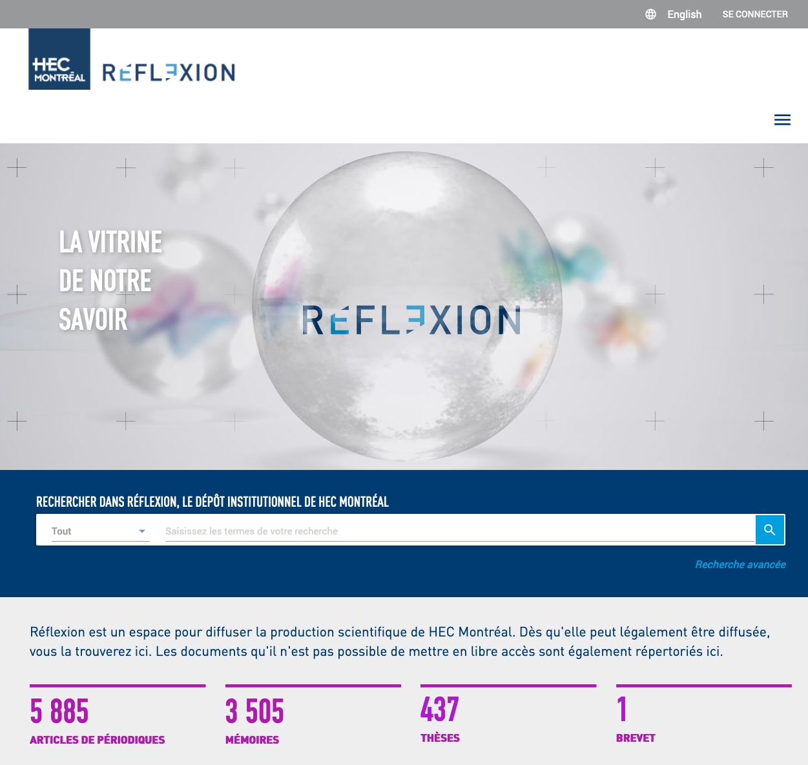
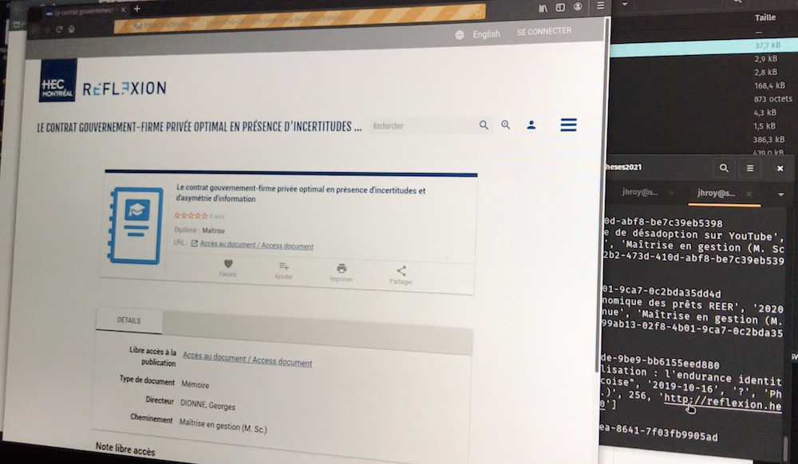
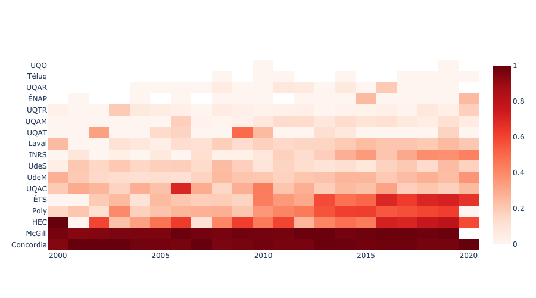

# Thèses et mémoires du Québec (2e édition; 2021)

Mise à jour d'une [étude réalisée en 2016](https://github.com/jhroy/theses) sur la longueur des thèses et mémoires du Québec. La première édition couvrait la période 1995-2016 et ne comptait que 13 universités. Cette seconde édition est donc revue (2000 à 2020) et augmentée (17 universités).

Le travail décrit ci-dessous a servi à deux articles publiés par le *Magazine* de l'Acfas&nbsp;:

- [Les thèses et les mémoires publiés au Québec raccourcissent...](https://www.acfas.ca/publications/magazine/2021/04/theses-memoires-publies-au-quebec-raccourcissent) (avril 2021) et
- [*Trending* au Québec : faire son mémoire ou sa thèse *in English*](https://www.acfas.ca/publications/magazine/2021/06/trending-au-quebec-faire-son-memoire-sa-these-in-english) (juin 2021)

### L'ensemble des données se trouve dans le fichier [**thesesQC_2000-2020.csv**](thesesQC_2000-2020.csv)

Merci d'ajouter une ⭐ à ce répertoire si vous téléchargez ces données et si vous les appréciez. Elles ont été longues à récolter! Je vous raconte ça 👇

## Source des données

Moissonner des données dans les répertoires institutionnels des universités, au Québec, c'est comme faire du ski de fond. Il y a quatre niveaux:

###  Facile

Pas moins de onze universités proposent (merci 🙏) le téléchargement de leur répertoire institutionnel (en format CSV ou JSON, notamment):
- [Spectrum](https://spectrum.library.concordia.ca/) de l'Université Concordia
- [Espace ETS](https://espace.etsmtl.ca/)
- [Espace ENAP](http://espace.enap.ca/)
- [Espace INRS](http://espace.inrs.ca/cgi/search/simple)
- [Polypublie](https://publications.polymtl.ca/) de Polytechnique Montréal
- [Archipel](https://archipel.uqam.ca/) de l'UQAM
- [Sémaphore](http://semaphore.uqar.ca/) de l'UQAR
- [Depositum](https://depositum.uqat.ca/) de l'UQAT
- le [Dépôt institutionnel de l'UQO](http://dpndev.uqo.ca/)
- [Cognitio](http://depot-e.uqtr.ca/) de l'UQTR et
- [R libre](https://r-libre.teluq.ca/) de l'Université Téluq

À noter que le [*Repository*](https://eprints.ubishops.ca/) de l'Université Bishop's ne contient aucun mémoire ni thèse, ce qui est indicatif du fait que les répertoires institutionnels ne contiennent peut-être pas toute la production des étudiant.e.s aux cycles supérieurs du Québec.

###  Intermédiaire

D'autres insititutions ont nécessité un moissonnage qui a été réalisé à partir de la [section Thèses et mémoires d'Érudit](https://www.erudit.org/fr/theses/) et à l'aide d'un script distinct.

Dans trois cas, chacun de ces scripts commençait par parcourir toutes les pages de toutes les années (2000 à 2020) pour une université donnée. Sur chacune de ces pages ([la 20e de l'année 2014 pour l'Université de Montréal](https://www.erudit.org/fr/theses/udem/2014/?page=20), par exemple), le script se connectait à tous les liens qu'elle contenait. Chacun de ces liens nous menait à la page du répertoire institutionnel de l'université contenant les métadonnées et le fichier PDF de la thèse ou du mémoire correspondant. Et c'est ici que mes scripts devaient s'adapter à la structure du code HTML de chaque répertoire pour aller chercher les informations qui m'intéressaient (titre, nom de l'auteur.trice, année, département, etc.), ainsi que pour trouver le fichier PDF, le télécharger, en compter le nombre de pages, puis l'effacer pour ne pas faire exploser le disque dur de mon ordinateur.

Voici les scripts que j'ai rédigés pour&nbsp;:
- l'Université de Montréal ([**udem.py**](udem.py))
- l'Université de Sherbrooke ([**udes.py**](udes.py))
- l'Université Laval ([**laval.py**](laval.py) -- seul ce script est accompagné de commentaires pour en décrire le fonctionnement)

À quelques nuances près, vous verrez que les trois scripts font un travail très semblable.

L'UQAC est elle aussi dans Érudit, mais je ne suis pas passé par là. J'ai trouvé plus facile d'exporter [une seule page HTML de son répertoire institutionnel](uqac.html) et d'effectuer un moissonnage à partir de cette unique page, ce qui donne un script beaucoup plus simple ([**uqac.py**](uqac.py)) et un moissonnage plus rapide.

À noter, enfin, que les données des répertoires de certaines universités ne comptaient pas le nombre de pages de certaines de leurs dissertations. J'ai dû rédiger de courts scripts pour compléter ces données dans les cas de&nbsp;:
- Concordia ([**concordia.py**](concordia.py))
- Polytechnique Montréal ([**poly.py**](poly.py)) et
- l'UQAM ([**uqam.py**](uqam.py))

###  Difficile

McGill se trouve dans Érudit, mais quand j'ai voulu y reproduire les scripts que j'avais rédigés pour l'UdeM, l'UdeS et Laval, j'ai rencontré un problème particulier. Les liens que contiennent Érudit pointent vers l'ancien répertoire institutionnel de McGill, appelé Digitool. Quand on clique sur une thèse ou un mémoire de cette université dans Érudit, on est d'abord envoyé vers Digitool, puis on est redirigés vers le nouveau répertoire, [eScholarship](https://escholarship.mcgill.ca/). Le problème, c'est que mon script initialement avait du mal à suivre cette redirection.

Je vous donne un exemple. Pour le mémoire en droit de Sophie Beaudoin sur la procréation assistée, publié en 2012, Érudit nous donne l'URL suivant:

http://digitool.library.mcgill.ca/R/-?func=dbin-jump-full&amp;current_base=GEN01&amp;object_id=110698

En fait, l'URL définitif pour ce mémoire est le suivant:

https://escholarship.mcgill.ca/concern/theses/db78tg815?locale=en

Comme la redirection automatique ne fonctionnait pas quand mon script se connectait au premier URL, je cherchais un point commun entre les deux URL... Mais il n'y en a aucun. Habituellement, chaque thèse ou mémoire a un identifiant unique. Mais dans le cas de McGill, ils en on deux. Un pour l'ancien répertoire (et dans notre exemple, cet identifiant est inscrit dans l'URL juste après `object_id`, à savoir **110698**), un pour le nouveau (toujours dans notre exemple, on le retrouve juste avant le `?locale=en` et il s'agit de **db78tg815**). Comment associer ces deux identifiants?

En fouinant dans les outils pour développeurs, j'ai trouvé sur le site de McGill [un fichier javascript appelé *redirect.js* qui joue justement le rôle de table de correspondance](https://testtool.library.mcgill.ca/redirects.js) entre ces deux identifiants. J'ai transposé cette table de correspondance dans un fichier python (il y a plus de 51&nbsp;000 paires d'identifiants qui y sont associés) que j'ai appelé [**correspondances.py**](correspondances.py). Faites-y une recherche avec les deux identifiants du mémoire de Mme Beaudoin si vous êtes curieux-ses. C'est grâce à cette table que mon script [**mcgill.py**](mcgill.py) a finalement pu moissonner les milliers de documents se trouvant dans le répertoire de McGill.

###  Très difficile!!!

Il n'y a qu'une université dont je n'ai pas encore parlé&nbsp;: HEC Montréal. Son répertoire, [Réflexion](https://reflexion.hec.ca/) (inaccessible au moment où ces lignes sont écrites, mi-juin 2021), a été un véritable casse-tête à moissonnner. Voici le sentier tortueux que j'ai dû emprunter.

J'ai d'abord copié-collé (eh oui) le code HTML de deux résultats de recherche dans son répertoire&nbsp;:
- l'un pour les doctorats&nbsp;: [**hec-doctorats.html**](hec-doctorats.html) et
- deux pour les maîtrises&nbsp;: [**hec-maitrises-1.html**](hec-maitrises-1.html) et [**hec-maitrises-2.html**](hec-maitrises-2.html)

Ensuite un premier script ([**hec0.py**](hec0.py)) allait les lire pour en extraire les identifiants uniques (des *uuid*) de chaque thèse ou mémoire et les confiner dans un fichier csv ([**hecURLs.csv**](hecURLs.csv))...

... qu'un second script ([**hec.py**](hec.py)) devait lire, puis utiliser [Selenium](https://selenium-python.readthedocs.io/) afin de simuler un être humain naviguant sur le site de HEC Montréal pour aller recueillir, très lentement, les métadonnées sur les plus de 5&nbsp;000 dissertations déposées ces vingt dernières années dans cette institution. Pour vous donner une idée de la lenteur de cette opération, voyez la vidéo ci-dessous&nbsp;:

## Conciliation

Je donne plusieurs détails méthodologiques dans les articles publiés dans le *Magazine* de l'Acfas. Je peux ajouter que&nbsp;:
- Parfois, dans un dépôt institutionnel, on trouve des thèses ou mémoires réalisés dans d'autres universités. Lorsque l'université était québécoise, cette thèse était conservée et attribuée à l'autre université, sinon elle était retranchée. Dans le cas de cotutelles, s'il y avait au moins une université québécoise d'impliquée, la thèse ou le mémoire étaient conservés et attribués à l'université québécoise.
- Il arrivait aussi qu'une même dissertation se retrouve dans deux répertoires institutionnels québécois différents. C'est le cas de ce mémoire en liguistique, par exemple, qui est présent à la fois [dans le répertoire de l'UQAC](https://constellation.uqac.ca/2969/) et dans [celui de l'Université Laval](https://corpus.ulaval.ca/jspui/handle/20.500.11794/25356?mode=full). À quelle université l'attribuer? À l'université à laquelle est rattaché(e) le ou la prof qui a supervisé le travail. Ici, parce qu'il s'agit d'une «&nbsp;Maîtrise en linguistiqu de l'Université Laval offert[e] en extension à l'Université du Québec à Chicoutimi&nbsp;», il pourrait être tentant de choisir l'Université Laval puisque c'est elle qui décerne le grade et que celui-ci n'est qu'«&nbsp;étendu&nbsp;» à l'UQAC. Mais ce serait faire fi de l'institution qui réalise le travail le plus essentiel, celui de la supervision de l'étudiant ou de l'étudiante.
- J'ai par ailleurs tout fait pour éliminer les doublons; il est néanmoins possible que certains aient pu échapper à ma vigilance.
- Mes scripts étaient conçus pour passer au document suivant s'ils éprouvaient quelque difficulté que ce soit à se connecter aux répertoires institutionnels; il est donc possible qu'il manque des documents.
- Il faut se rappeler que mon travail ne permet de se pencher que sur **le contenu des répertoires institutionnels des universités québécoises**. Il ne prétend pas regrouper la totalité de la production des étudiant-e-s des cycles supérieurs durant la période étudiée, car les pratiques d'utilisation des dépôts institutionnels ne sont pas les mêmes partout et ont changé au fil des ans.

Une fois ce nettoyage des données, j'ai réuni tous les fichiers CSV obtenus en ne conservant que 10 variables par document, en incluant des données de [ProQuest Dissertations & Theses Global](https://about.proquest.com/en/products-services/pqdtglobal/) fournies par [Vincent Larivière](https://ebsi.umontreal.ca/repertoire-ecole/vue/lariviere-vincent/) et ayant permis de combler un vide pour les années 2000 à 2008 dans le cas de Polytechnique Montréal.

## Détection des langues

Lors de mon moissonnage, je voulais d'abord compter le [nombre de pages](https://www.acfas.ca/publications/magazine/2021/04/theses-memoires-publies-au-quebec-raccourcissent) des thèses et mémoires. Mais je me suis rendu compte qu'une autre métadonnée intéressante, pas toujours disponible, pouvait être pertinente&nbsp;: [la langue](https://www.acfas.ca/publications/magazine/2021/06/trending-au-quebec-faire-son-memoire-sa-these-in-english) de ces thèses et mémoires.

J'ai d'abord soumis les **titres** de toutes les dissertations à une première vérification. Chaque titre était analysé par trois modules gratuits de détection de la langue ([*langId*](https://pypi.org/project/langid/), [*langDetect*](https://pypi.org/project/langdetect/) et [*Polyglot*](https://pypi.org/project/polyglot/)). Lorsque deux ou trois sur trois s'entendaient sur la langue dans laquelle il était rédigé, cette langue était attribuée au document. C'est le script [**langues.py**](langues.py) qui fait ce travail.

J'ai cependant voulu faire une deuxième vérification dans le **texte complet** des thèses et mémoires lui-même. J'ai donc constitué un échantillon avec&nbsp;:
- les cas où la langue du titre détectée par mon script *langues.py* différait de celle indiquée par les métadonnées (1&nbsp;300 cas),
- les documents dont le titre était bilingue, chaque langue séparée par le symbole égal (« = »),
- toutes les thèses ou mémoires dont le titre est en anglais et qui ont été diffusés après 2010, histoire de vérifier s'il y a effectivement une anglicisation dans la production des étudiant-e-s des cycles supérieurs ces dernières années.

L'échantillon en question se trouve dans un fichier que j'ai baptisé, de façon tout à fait originale, [**echantillon.csv**](echantillon.csv). Il regroupe près de 5&nbsp;000 thèses et mémoires (6,5% de l'ensemble).

Ma deuxième vérification mobilise l'outil [Translator](https://docs.microsoft.com/fr-ca/azure/cognitive-services/translator/quickstart-translator?tabs=python) des Services cognitifs de Microsoft. Elle est réalisée par le script [**langues-verif.py**](langues-verif.py) qui a dû exclure les thèses et mémoires de HEC Montréal dont le répertoire n'était pas accessible au moment où elle a été effectuée (début juin 2021).

## Réalisation des graphiques

Pour la réalisation des graphiques, je me suis servi de la formidable bibliothèque graphique [plotly express pour python](https://plotly.com/python/plotly-express/), fièrement conçue à Montréal.

Mon préféré est celui-ci, qui illustre bien la tendance à l'anglais dans les thèses de certaines universités&nbsp;:

Voilà l'essentiel de mon parcours méthodologique. Pour toute question, commentaire, ou pour me dire que mes skis étaient mal fartés, [écrivez-moi](mailto:roy.jean-hugues@uqam.ca)!

En attendant, comme je le disais plus haut, l'ensemble des données se trouve dans le fichier [**thesesQC_2000-2020.csv**](thesesQC_2000-2020.csv).
